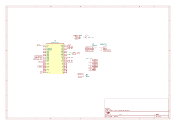

# ESP32 Ukulele Tuner (Rust)
A real-time ukulele tuner using ESP32 and Rust with visual feedback on a TFT display.

:::info

**Author**: Oprea Radu - Gabriel \
**GitHub Project Link**: https://github.com/UPB-PMRust-Students/fils-project-2026-Radur12

:::

## Description

A simple real-time ukulele tuner that captures audio using a digital microphone, detects pitch, and displays tuning accuracy (flat, sharp, or correct) on a TFT screen.

## Motivation

This project was chosen to explore embedded systems programming with Rust, real-time audio processing, and hardware interfacing. It combines signal processing with a practical and interactive use case (musical instrument tuning), making it both educational and useful.

## Architecture

### Main components:

Audio Input Module (INMP441 microphone)
Signal Processing Module (YIN pitch detection)
Control Unit (ESP32 microcontroller)
Output Interface (TFT display)
Actuator Module (DS04-NFC continuous rotation servo)
Audio Feedback Module (3.3V passive buzzer)

### Connections:

The microphone captures sound via I2S and sends it to the ESP32.
The ESP32 processes the signal to detect frequency (pitch detection).
The detected pitch is compared with standard ukulele tuning values (G4, C4, E4, A4).
Results are sent to the TFT display, showing whether the note is flat, sharp, or in tune.
If the detected string is flat or sharp, the ESP32 drives the DS04-NFC continuous rotation servo to tighten or loosen the string.
When the string is in tune, the passive buzzer provides a short audio confirmation.

### System Data Flow

## Log

### Week 5 - 11 May

Initial project setup, component selection, and environment configuration for Rust on ESP32.

### Week 12 - 18 May

Implemented audio capture via I2S and basic signal processing (FFT).

### Week 19 - 25 May

Integrated display output and completed pitch detection logic with visual feedback.

## Hardware

ESP32 DevKit1 (ESP-WROOM-32)
INMP441 I2S Digital Microphone
1.44" SPI LCD Module with ST7735 Controller (128x128 px)
DS04-NFC Continous Rotation Servo
3.3V Passive Buzzer
SYB-170 Colored Mini Breadboard
30 cm 40p Male-Female Wires

### Schematics

### Bill of Materials

| Device | Usage | Price |
|--------|--------|-------|
| [ESP32 DevKit V1](https://sigmanortec.ro/placa-dezvoltare-esp32-cu-wifi-si-bluetooth?SubmitCurrency=1&id_currency=2&srsltid=AfmBOoqsWrsP--au7FCZ8bSrXUsl5neEnXNTZ6X_o2jJOZFMJI9ANC0hGgE) | Main microcontroller | [42 RON](https://sigmanortec.ro/placa-dezvoltare-esp32-cu-wifi-si-bluetooth?SubmitCurrency=1&id_currency=2&srsltid=AfmBOoqsWrsP--au7FCZ8bSrXUsl5neEnXNTZ6X_o2jJOZFMJI9ANC0hGgE) |
| [INMP441 I2S Microphone](https://www.optimusdigital.ro/en/others/12548-inmp441-mems-high-precision-omnidirectional-microphone-module-i2s.html?srsltid=AfmBOoorwAe9erzXWIhca8h9l2gHLA-k6hmzWy75FjUOStzRLvaQ1qG6) | Audio input for pitch detection | [20 RON](https://www.optimusdigital.ro/en/others/12548-inmp441-mems-high-precision-omnidirectional-microphone-module-i2s.html?srsltid=AfmBOoorwAe9erzXWIhca8h9l2gHLA-k6hmzWy75FjUOStzRLvaQ1qG6) |
| [1.44" SPI LCD Module with ST7735 Controller (128x128 px)](https://www.optimusdigital.ro/en/lcds/3552-modul-lcd-de-144-cu-spi-i-controller-st7735-128x128-px.html) | Displays tuning feedback | [30 RON](https://www.optimusdigital.ro/en/lcds/3552-modul-lcd-de-144-cu-spi-i-controller-st7735-128x128-px.html) |
| [DS04-NFC Continous Rotation Servo](https://www.optimusdigital.ro/en/servomotors/1161-ds04-nfc-continous-rotation-servo.html?search_query=servo&results=171) | Mechanically tightens or loosens the ukulele string | [40 RON](https://www.optimusdigital.ro/en/servomotors/1161-ds04-nfc-continous-rotation-servo.html?search_query=servo&results=171) |
| [3.3V Passive Buzzer](https://www.optimusdigital.ro/en/buzzers/12247-3-v-or-33v-passive-buzzer.html?search_query=buzzer&results=62) | Audio feedback when the string is in tune | [1 RON](https://www.optimusdigital.ro/en/buzzers/12247-3-v-or-33v-passive-buzzer.html?search_query=buzzer&results=62) |
| [SYB-170 Colored Mini Breadboard](https://www.optimusdigital.ro/en/breadboards/244-white-mini-breadboard.html?search_query=breadboard&results=194) | Prototyping board for connecting the modules | [2 RON](https://www.optimusdigital.ro/en/breadboards/244-white-mini-breadboard.html?search_query=breadboard&results=194) |
| [30 cm 40p Male-Female Wires](https://www.optimusdigital.ro/en/wires-with-connectors/878-set-fire-mama-tata-40p-30-cm.html?search_query=wires&results=429) | Jumper wires for connecting the ESP32, display, microphone, buzzer, and servo | [10 RON](https://www.optimusdigital.ro/en/wires-with-connectors/878-set-fire-mama-tata-40p-30-cm.html?search_query=wires&results=429) |

---

## Software

| Library | Description | Usage |
|---------|-------------|-------|
| [esp-idf-svc](https://github.com/esp-rs/esp-idf-svc) | ESP-IDF bindings and services for Rust | Used for GPIO, SPI, I2S, LEDC/PWM, delays, and logging |
| [embedded-hal](https://github.com/rust-embedded/embedded-hal) | Hardware abstraction traits | Used for SPI and GPIO traits in the ST7735 display driver |
| [anyhow](https://github.com/dtolnay/anyhow) | Error handling library | Used to simplify error propagation across hardware initialization and runtime logic |
| [log](https://github.com/rust-lang/log) | Logging facade | Used for serial debug messages during pitch detection |
| [embassy-time](https://github.com/embassy-rs/embassy) | Embedded timing support | Provides the generic time queue required by the ESP-IDF service features |
| [espup](https://github.com/esp-rs/espup) | ESP Rust tooling | Used for installing and configuring the Rust toolchain for ESP32 |
| [espflash](https://github.com/esp-rs/espflash) | ESP flashing tool | Used to upload the compiled firmware to the ESP32 |

---

## Links

1. [ESP32 INMP441 - audio](https://github.com/ZioTester/ESP32-MMB-MAX98357A-INMP441-audio)
2. [embedded-graphics examples](https://github.com/embedded-graphics/embedded-graphics/tree/master)
3. [rustfft documentation](https://github.com/ejmahler/RustFFT)
