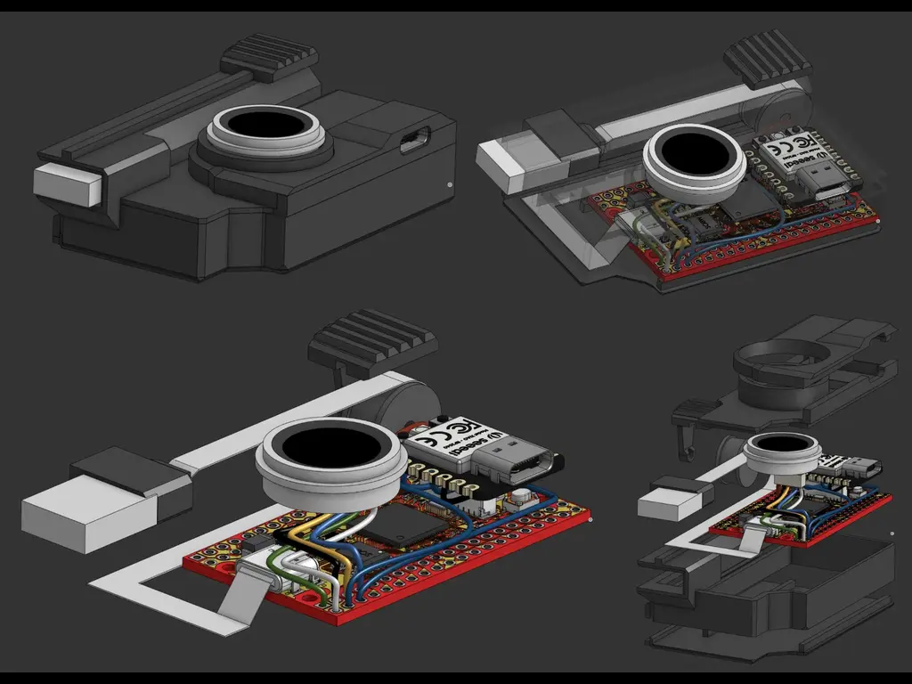
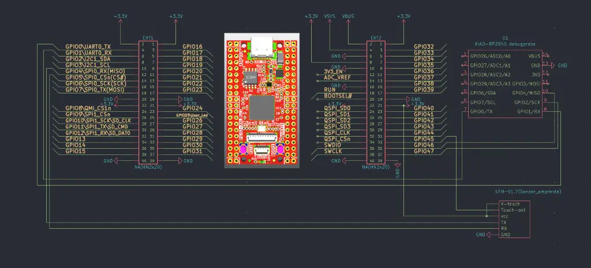
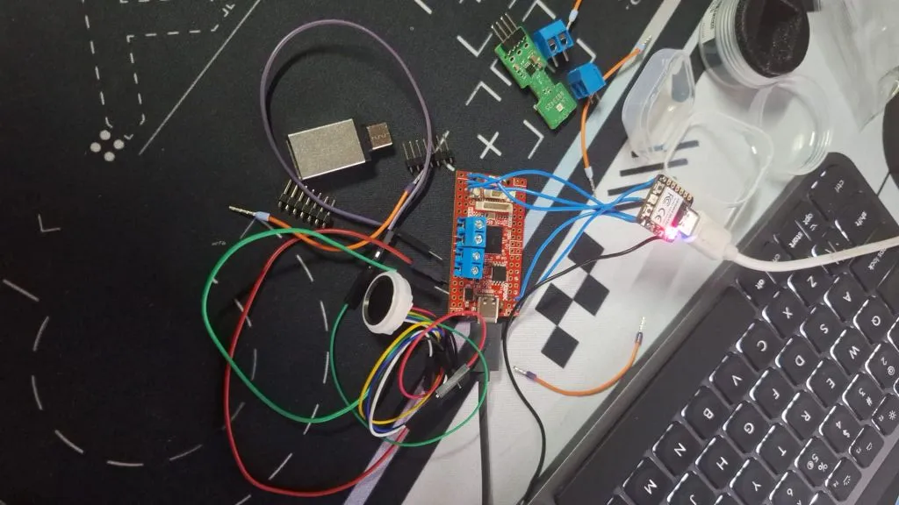

# Pass Vault
A biometric hardware security key that acts as a USB HID keyboard, mapping 10 fingerprints to specific passwords or macros.

:::info 

**Author**: Polojan Radu-Mihai \
**GitHub Project Link**: https://github.com/UPB-PMRust-Students/fils-project-2026-radupolojan

:::

<!-- do not delete the \ after your name -->

## Description

The Pass Vault is a hardware security device that stores encrypted passwords and types them automatically when a recognized fingerprint is scanned. By acting as a USB keyboard (HID), it requires no special software on the host PC. It features a Multi-Profile interface where each finger triggers a different credential, all managed via a secure USB-C smartphone or pc companion app.

## Motivation

I chose this project to create a physical-first security solution that eliminates the vulnerability of software-based password managers. It combines biometric authentication with Rust’s memory safety to ensure that credentials remain unhackable and accessible only by the physical owner.

## Architecture 

## Log

<!-- write your progress here every week -->

### Week 5 - 11 May
* Bought and collected all the hardware components (Olimex RP2350 board, SFM-V1.7 sensor, and XIAO RP2040 board).
* Checked the pinouts and connection diagrams for the parts.
### Week 12 - 18 May
* Wrote most of the microcontroller firmware code in Rust.
* Studied and tested the `embassy` and `usb` libraries to understand how asynchronous hardware communication works.
* Made the fingerprint sequential enrollment logic and the USB keyboard emulation.
### Week 19 - 25 May
* Created the desktop companion application for the PC using egui.
* Designed the 3D case for the device and successfully 3D-printed the final physical enclosure.
## Hardware

The project uses the high-pin-count RP2350B, featuring 16MB FLASH and a 8MB PSRAM for advanced data handling and an XIAO RP2040 as the debugger.

### Schematics

### Bill of Materials

-->

| Device | Usage | Price |
|--------|--------|-------|
| [RP2350-PICO2-XXL OLIMEX](https://www.tme.eu/ro/details/rp2350-pico2-xxl/kituri-de-dezvoltare-altele/olimex/) | Main MCU | [55 RON](https://www.tme.eu/ro/) |
| [Senzor amprenta SFM-V1.7](https://www.emag.ro/modul-senzor-amprenta-sfm-v1-7-ai779-s808/pd/DLGZLTMBM/?ref=history-shopping_485604297_38837_3) | Biometric authentication | [94 RON](https://www.emag.ro/) |
| [Seeed Studio XIAO RP2040](https://www.tme.eu/ro/details/seeed-102010428/kituri-de-dezvoltare-altele/seeed-studio/xiao-rp2040/) | Hardware SWD Debug Probe | [30 RON](https://www.tme.eu/ro/) |

## Software

| Library | Description | Usage |
|---------|-------------|-------|
| [embassy-rp](https://github.com/embassy-rs/embassy) | Async runtime and HAL for RP2040/RP2350 | Provides async drivers for hardware timers, UART communication with the sensor, and internal flash controllers. |
| [embassy-usb](https://github.com/embassy-rs/embassy) | Asynchronous USB device stack | Handles the concurrent USB stack, configuring the device as a composite USB CDC Serial class and USB HID Keyboard. |
| [usbd-hid](https://github.com/lyonel/usbd-hid) | USB HID class and report descriptor generator | Generates the official boot keyboard reports used to type decrypted characters into any OS host text-field. |
| [embedded-storage](https://github.com/rust-embedded/embedded-storage) | Storage traits for embedded systems | Provides standardized interfaces to safely interact with non-volatile memory sectors. |
| [eframe / egui](https://github.com/emilk/egui) | Immediate mode GUI framework for Desktop | Drives the minimalist PC companion application interface, managing background thread message passing channels. |
| [serialport-rs](https://github.com/serialport/serialport-rs) | Cross-platform serial port library for Rust | Enables the desktop client app to perform background plug-and-play USB hardware polling based on unique VID/PID signatures. |

## Links

<!-- Add a few links that inspired you and that you think you will use for your project -->

1. [Rust documentation](https://youtu.be/oWThq9rKjQw?si=yXI7mbcZzjzmGdt4)
2. [XIAO RP2040 as DebugProbe](https://community.element14.com/products/raspberry-pi/b/blog/posts/seeed-studio-xiao-rp2040-as-picoprobe)
3. [ChaCha20 Algorithm](https://datatracker.ietf.org/doc/html/rfc7539)
4. [Egui / Eframe](https://www.youtube.com/watch?v=zZKjBMt4kZ4)
5. [Egui / Eframe git](https://github.com/emilk/egui)
6. [Embassy Framework (Async Rust Embedded)](https://embassy.dev/book/)