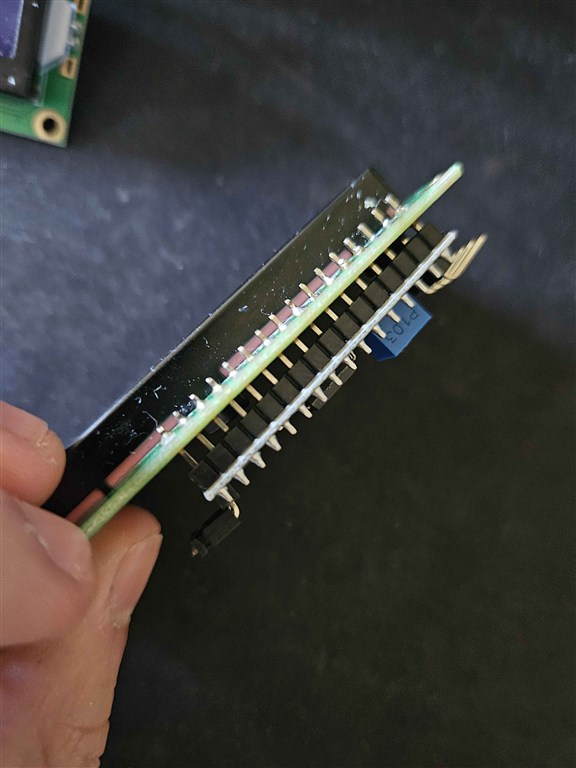
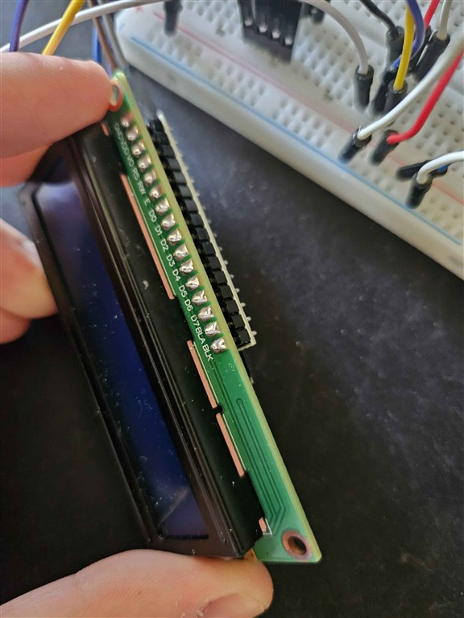
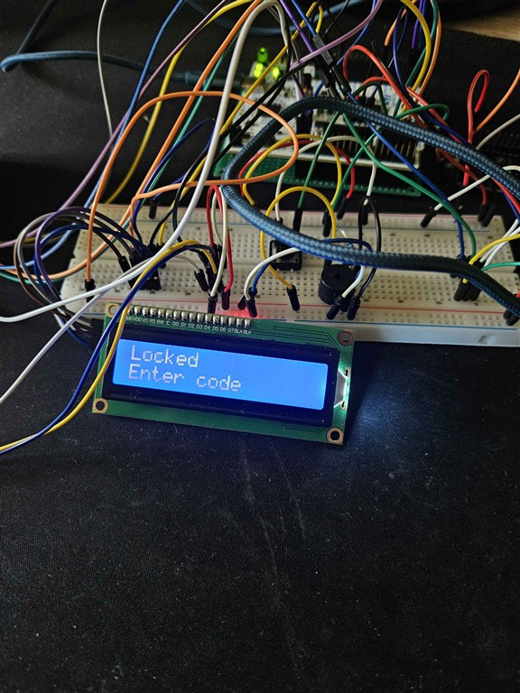
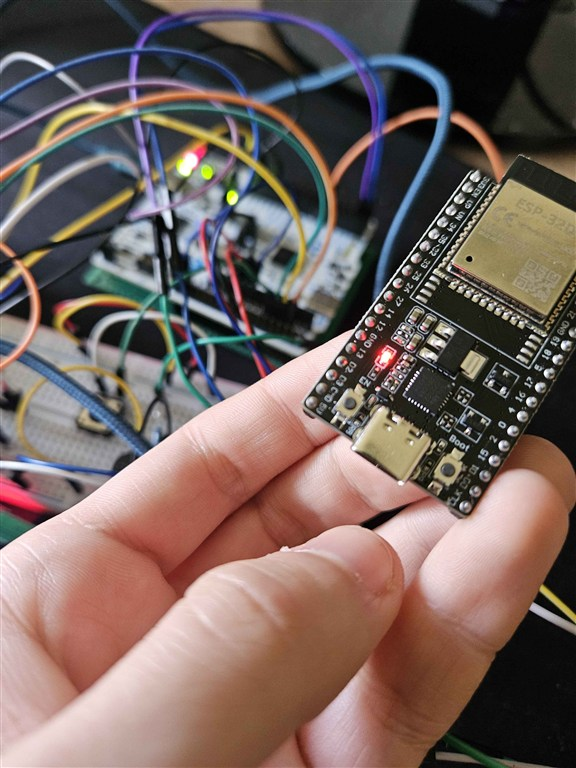
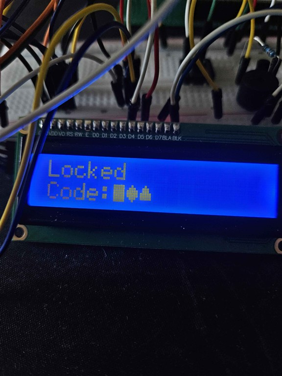
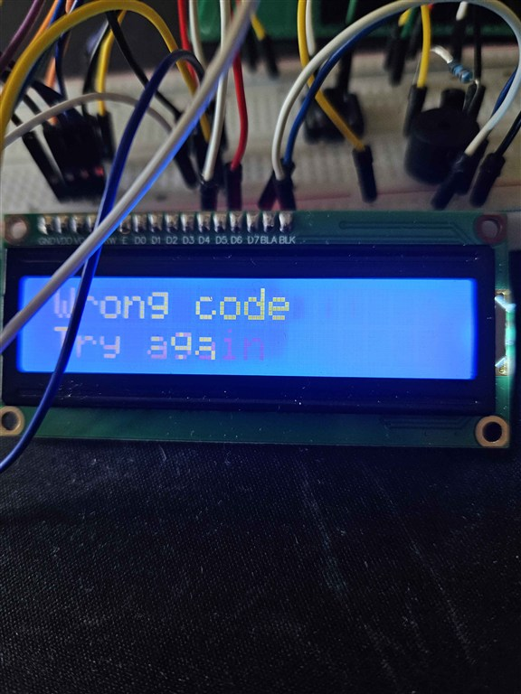
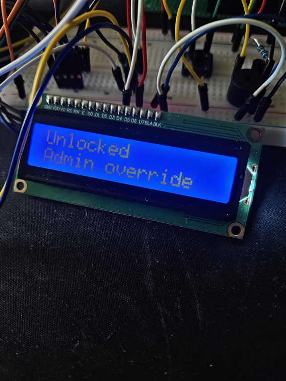
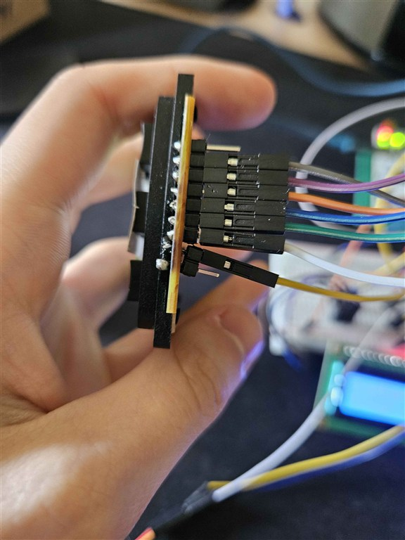
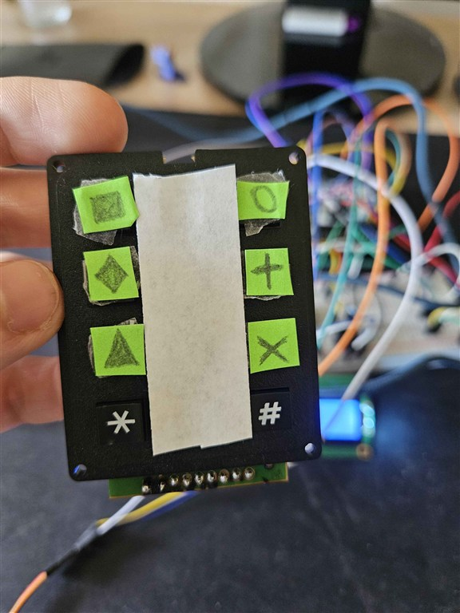
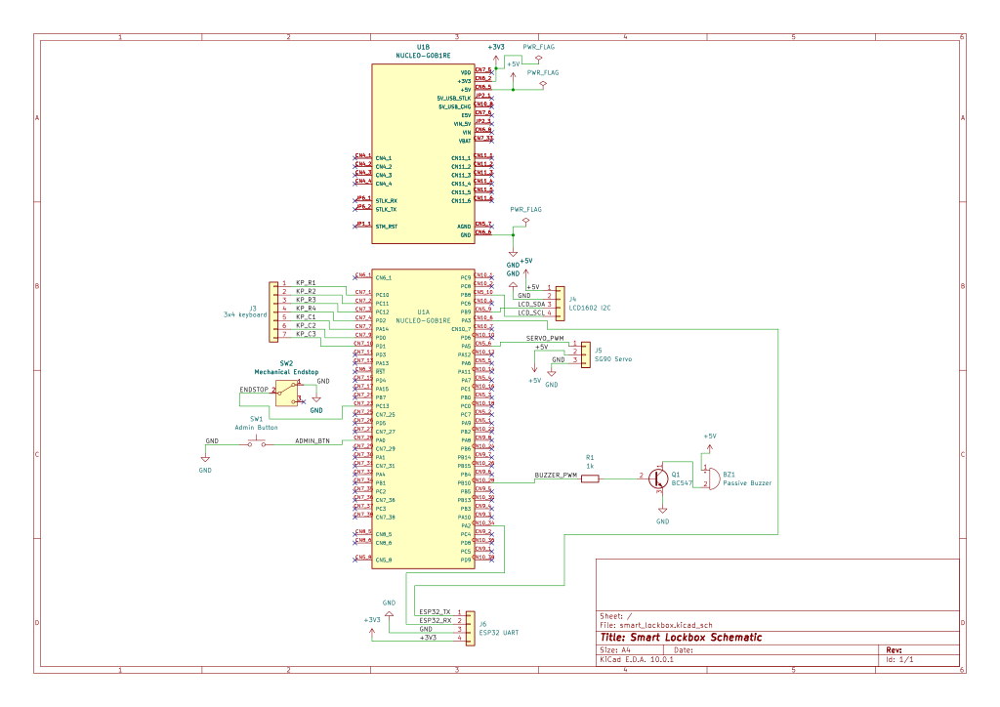

# Smart Lockbox
A Rust-based electronic lockbox with keypad PIN access, servo lock control, local feedback, and ESP32 networking for logs/admin reset.

:::info

**Author**: Sergiu Lefter \
**GitHub Project Link**: [fils-project-2026-sergiulefter](https://github.com/UPB-PMRust-Students/fils-project-2026-sergiulefter)

:::

<!-- do not delete the \ after your name -->

## Description

This project is a smart lockbox controlled by an STM32 Nucleo board.
The user enters a PIN on a 3x4 keypad. If the PIN is correct, an SG90 servo unlocks the box. If it is wrong, access is denied and a passive buzzer gives warning feedback.

For the extended version, I added an ESP32 for network logging, remote commands, and a local admin panel for PIN management.

## Motivation

I chose this project because it is practical and also a good embedded Rust challenge.
It combines hardware and software in one system: keypad input, control logic, servo actuation, user feedback, and communication.
I also wanted to build something physical that I can test and improve step by step.

## Architecture

Main architecture components:
- Input: 3x4 keypad and one admin button.
- Main controller: STM32 Nucleo.
- Output: SG90 servo, LCD1602 with I2C backpack, passive buzzer.
- Network side: ESP32 DevKitC with a small web admin panel.
- Assembly: one 7x9 interface protoboard for the STM32 connection and one 7x9 main protoboard for the rest of the circuit.

How the system works:
- The keypad sends the PIN to the STM32.
- The STM32 checks the PIN, controls the servo, updates the LCD, and triggers the buzzer.
- The admin button is used for local override/reset actions.
- The ESP32 talks to the STM32 over UART and provides logging plus a simple Wi-Fi admin panel.
- I used two protoboards so I would not solder directly on the rental STM32 board.

### Software State Machine

The software is organized around a small access-control state machine:
- `PIN_SETUP`: active when no valid PIN is stored yet. The box stays accessible and the user must define a new PIN.
- `LOCKED`: normal idle state after a PIN exists. The system waits for keypad input and compares it with the saved code.
- `UNLOCKED`: entered after a valid PIN or an admin override. In this state the servo opens the mechanism and the UI shows that access is granted.

The implementation is split into two software parts:
- STM32 firmware written in Rust with Embassy. This side handles keypad scanning, servo control, LCD updates, buzzer patterns, UART communication, and flash-backed PIN persistence.
- ESP32 admin-panel firmware written as an Arduino sketch. This side creates a local Wi-Fi access point, serves the web panel, forwards commands over UART, and keeps temporary logs in RAM.

For hardware bring-up and debugging, the STM32 firmware also includes multiple `FirmwareMode` test modes:
- `BuzzerTest`
- `ServoTest`
- `KeypadTest`
- `AdminButtonTest`
- `UartTest`
- `FullApp`

## Log

<!-- write your progress here every week -->

### Week 4-5
Researched smart lockbox implementations and decided on the final project direction. Chose the main architecture around STM32 + keypad + servo and started the documentation page.

### Week 6-7
Updated the hardware plan and replaced several components: breadboard with protoboard, 4x4 keypad with 3x4 keypad, and active buzzer with passive buzzer. Ordered all required parts and checked compatibility.

### Week 8
Defined the interface-board approach to avoid soldering on the rental STM32 board (female header bridge through a dedicated 7x9 protoboard). Added ESP32 networking scope for event logging and a local admin control flow.

### Week 9-10
Started putting together the hardware and moving from planning to real assembly. A big part of this stage was debugging early hardware issues, especially the LCD, which initially powered on but did not show text correctly.

### Week 11-12
Continued debugging all hardware components until they became reliable. I discovered that I had badly soldered the I2C backpack onto the LCD, so I had to buy a new one and solder it again correctly on the second attempt. After that, I got almost all major components working on a breadboard, with the ESP being the first one I brought up successfully.

### Week 13-14
Implemented software testing modes through `FirmwareMode` and also built the ESP32 web admin panel. During final hardware assembly I badly soldered one keypad pin and burned the keypad, so I had to rethink the keypad concept and adapt the layout creatively using symbols instead of the original numeric-only interaction.

## Hardware

The lockbox prototype uses a mixed setup with reusable university hardware and purchased modules.
The STM32 board is provided by the university as free rental (must be returned after project completion).
The rest of the circuit is assembled using two 7x9 protoboard/PCB prototyping boards and silicone stranded wires.

### Schematics

### Bill of Materials

| Device | Usage | Price |
|--------|--------|-------|
| STM32 development board (university borrow) | Main controller board for firmware development and peripheral control | 0 RON (borrowed) |
| [Placa dezvoltare ESP32-DevKitC, ESP32-WROOM-32D, 38P](https://sigmanortec.ro/placa-dezvoltare-esp32-devkitc-esp32-wroom-32d-38p) | Networking/logging module and potential admin dashboard support | 42.56 RON |
| [Placa PCB prototipare fata dubla 7x9cm](https://sigmanortec.ro/Placa-PCB-prototipare-fata-dubla-7x9cm-p125747328) x2 | Two 7x9 protoboards: one interface board between STM32 and the wiring, and one main board for the rest of the components | 11.52 RON (total) |
| [Bara 40 pini 2.54 tata](https://sigmanortec.ro/Bara-40-pini-2-54-tata-p126025250) | Header pins for module interconnection | 2.06 RON |
| [Header de Pini Mama 8p 2.54 mm](https://www.optimusdigital.ro/ro/componente-electronice-headere-de-pini/4161-header-de-pini-mama-8p-254-mm.html?search_query=0104210000035056&results=1) x2 | Female headers for detachable wiring/interfaces | 0,98 RON |
| [Header de Pini Mama 10p 2.54 mm](https://www.optimusdigital.ro/ro/componente-electronice-headere-de-pini/4162-header-de-pini-mama-10p-254-mm.html?search_query=0104210000035063&results=1) | Female headers for detachable wiring/interfaces | 3,27 RON |
| [Header de Pini Mama 2p 2.54 mm](https://www.optimusdigital.ro/ro/componente-electronice-headere-de-pini/4140-header-de-pini-mama-2p-254-mm.html?search_query=0104210000034998&results=1) x2 | Female headers for detachable wiring/interfaces | 0,78 RON |
| [Header de Pini Mama de 2.54 mm 2 x 19p](https://www.optimusdigital.ro/ro/componente-electronice-headere-de-pini/8517-header-de-pini-mama-de-254-mm-2-x-19p.html?search_query=0104210000056457&results=1) x2 | Female headers for detachable wiring/interfaces | 1.78 RON |
| [Header de Pini Mama 6p 2.54 mm](https://www.optimusdigital.ro/ro/componente-electronice-headere-de-pini/4156-header-de-pini-mama-6p-254-mm.html?search_query=0104210000035032&results=1) | Female headers for detachable wiring/interfaces | 0,49 RON |
| [Tastatura numerica 4x3, 12 butoane](https://sigmanortec.ro/tastatura-numerica-4x3-12-butoane) | PIN entry keypad (3x4) | 18.76 RON |
| [Buton 12x12x7.3](https://sigmanortec.ro/Buton-12x12x7-3-p160373654) | Local control/input button | 1.33 RON |
| [Servomotor SG90, 180 grade, cu limitator](https://sigmanortec.ro/Servomotor-SG90-limit-switch-p141662062) | Mechanical lock actuation | 9.49 RON |
| [Buzzer pasiv 5V](https://sigmanortec.ro/Buzzer-pasiv-5v-p172425809) | Audio feedback for success/error events | 1.45 RON |
| [LCD 1602](https://sigmanortec.ro/LCD-1602-p125700685) | Status display for prompts and lock messages | 11.18 RON |
| [Modul interfata I2C LCD 1602/2004](https://sigmanortec.ro/Modul-interfata-I2C-LCD-1602-2004-p125700577) | I2C adapter for LCD communication | 5.11 RON |
| [Tranzistor NPN BC547 TO-92](https://sigmanortec.ro/Tranzistor-NPN-BC547-TO-92-p126458754) | Driver/transistor stage in auxiliary control circuits | 1.21 RON |

## Software

| Library/Framework | Description | Usage |
|---------|-------------|-------|
| [Embassy](https://embassy.dev/) | Async embedded Rust framework | Main embedded architecture and task scheduling |
| [embassy-stm32](https://docs.embassy.dev/embassy-stm32/) | STM32 peripheral support for Embassy | GPIO/I2C/PWM integration on STM32 |
| [embassy-executor](https://docs.embassy.dev/embassy-executor/) | Async executor | Runs concurrent embedded tasks |
| [embassy-time](https://docs.embassy.dev/embassy-time/) | Timing, delays, and timeouts | Debounce logic, unlock timers, and UI timing |
| [embassy-sync](https://docs.embassy.dev/embassy-sync/) | Synchronization primitives for Embassy | Background buzzer event channel between tasks |
| [embedded-hal](https://github.com/rust-embedded/embedded-hal) | Hardware abstraction traits | Portable driver interfaces |
| [defmt](https://github.com/knurling-rs/defmt) | Lightweight logging for embedded Rust | Structured firmware logs during development |
| [defmt-rtt](https://github.com/knurling-rs/defmt) | RTT transport for defmt | Real-time debug output |
| [panic-probe](https://github.com/knurling-rs/probe-run/tree/main/panic-probe) | Panic reporting | Panic handling during debugging |
| [heapless](https://github.com/rust-embedded/heapless) | `no_std` data structures | Fixed-capacity buffers/queues for embedded-safe logic |

## Links

1. [Project page requirements (FILS EN)](https://embedded-rust-101.wyliodrin.com/docs/fils_en/project)
2. [Embassy documentation](https://embassy.dev/)
3. [Rust Embedded Book](https://docs.rust-embedded.org/book/)
4. [ESP-RS Book](https://docs.esp-rs.org/book/)
