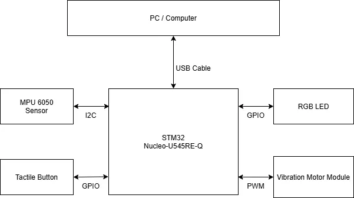
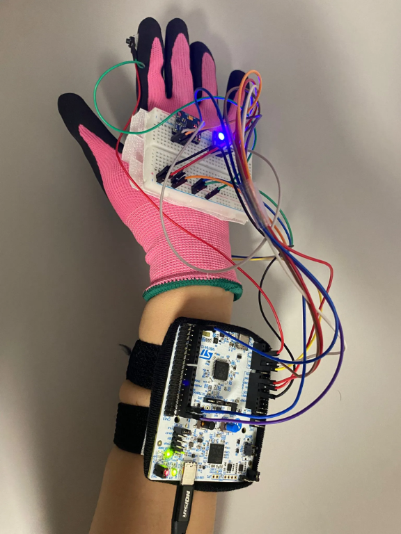
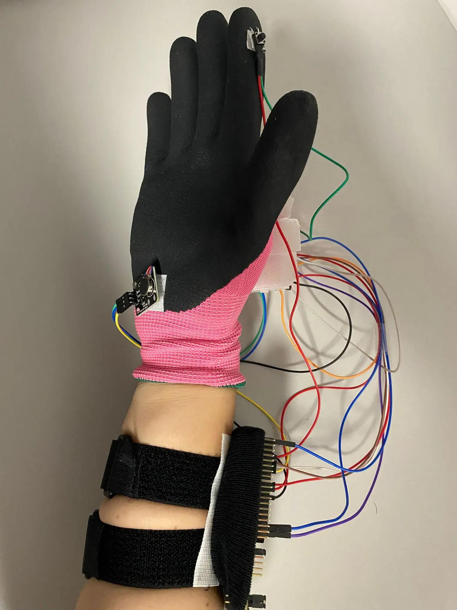
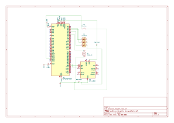

# AeroGlove: Interactive Gamepad
A wearable, motion-controlled gaming interface.

:::info 

**Author**: Boinegri Ștefania-Denisa \
**GitHub Project Link**: [https://github.com/UPB-PMRust-Students/fils-project-2026-dboinegri-hue](https://github.com/UPB-PMRust-Students/fils-project-2026-dboinegri-hue)

:::

## Description

AeroGlove is a glove that lets you control games by moving your hand. Tilt your palm and the joystick moves on screen. Press a button with your thumb and it sends an action. Hold the button longer than half a second and it switches between gamepad and air-mouse mode, with a short vibration to confirm.
 
The firmware runs on an STM32 Nucleo-U545RE-Q in Rust using the embassy async framework. It reads an MPU6050 motion sensor over I2C, applies a complementary filter to get stable angles, and sends the data over UART to a Python host script on the PC. The script creates a virtual Xbox 360 controller using the ViGEmBus driver, so any game that supports a controller recognizes it automatically.

## Motivation

AeroGlove was directly inspired by my time as an exchange student in Sweden, where a Neurotechnology class introduced me to P300-based Brain-Computer Interfaces (BCI). Working with that technology made me realize the impact students can have in developing assistive devices. I am designing AeroGlove for accesibility, with the belief that the joy of gaming and diving into the digital world should be available to everyone, including those with physical limitations.

## Architecture 

The main components are the STM32 Nucleo-U545RE-Q microcontroller, an MPU6050 accelerometer and gyroscope, a tactile push-button, an RGB LED, and a vibration motor module. The MPU6050 connects via I2C to capture spatial orientation. The microcontroller communicates bidirectionally with the PC via a USB Data Cable, sending inputs and receiving real-time feedback signals back from the computer to trigger the PWM-driven vibration motor.

## Log

### Week 5 - 11 May

Hardware wiring and basic project setup. Configured the Rust Embassy environment and got the MPU6050 sensor reading data via I2C. Wired the tactile button and tested basic GPIO inputs.

### Week 12 - 18 May

Tried to get USB HID working directly on the STM32 so the glove would show up as a native gamepad. Got the USB stack compiling and Windows detected the device, but it kept failing. After debugging with trace logs I found that the USB interrupt wasn't firing properly for the U545 chip in embassy-stm32. Decided to change the communication approach instead of fighting a driver bug.

### Week 19 - 25 May

Switched to sending data over UART through the ST-Link's built-in serial port. Wrote a Python host script that reads the serial stream and creates a virtual Xbox 360 controller using vgamepad and ViGEmBus. Also added the RGB LED module and implemented tilt-limit haptic feedback that vibrates when you tilt past 50 degrees.

Mounted everything on the glove with velcro. The breadboard sits on the back of the hand, the button is extended with soldered wires to the index finger, and the motor is on the palm side. Tested with Hill Climb Racing and the hardwaretester.com gamepad tester. Commented all the code and wrote the documentation.
 

## Hardware

The STM32 Nucleo-U545RE-Q is the main microcontroller. The MPU6050 connects over I2C for motion tracking. A tactile button on the index finger provides input, connected back to the breadboard with two soldered jumper wires. The RGB LED shows the current mode and the vibration motor gives haptic feedback. Everything sits on a breadboard on the back of the hand, with the Nucleo board either on the forearm or on the desk.
 
Only one USB cable is needed since the ST-Link handles both programming and serial communication.

### Schematics

### Bill of Materials

| Device | Usage | Price |
|--------|--------|-------|
| STM32 Nucleo-U545RE-Q | Microcontroller | 107 RON |
| MPU6050 Module | Motion sensing (accelerometer + gyroscope) | 12 RON |
| Tactile Push-Button 6x6x5mm | Digital input on finger | 0.36 RON |
| CJMCU RGB LED Module | Mode indicator (red/blue) | 2 RON |
| Vibration Motor Module | Haptic feedback | 5 RON |
| USB-C Cable | Power and ST-Link communication | 29 RON |
| Jumper Wires (M-M and M-F) | Connecting everything | 7 RON |
| Breadboard | Component mounting | 5 RON |
| Velcro strips | Attaching components to the glove | 15 RON |
## Software

| Library | Description | Usage |
|---------|-------------|-------|
| [embassy-stm32](https://github.com/embassy-rs/embassy) | Async HAL for STM32 | Provides drivers for I2C, UART, PWM and GPIO |
| [embassy-executor](https://github.com/embassy-rs/embassy) | Async task runtime | Runs 7 concurrent tasks on one core without an RTOS |
| [embassy-sync](https://github.com/embassy-rs/embassy) | Synchronization primitives | Watch and Channel for safe data sharing between tasks |
| [embassy-time](https://github.com/embassy-rs/embassy) | Timers and delays | Used for button debouncing, motor timing and sensor pacing |
| [defmt](https://github.com/knurling-rs/defmt) | Lightweight logging | Debug output over RTT without slowing down the firmware |
| [libm](https://github.com/rust-lang/libm) | Math functions for no_std | atan2 and sqrt needed for the angle calculations in the filter |
| [heapless](https://github.com/rust-embedded/heapless) | Fixed-size collections | Stack-allocated strings for formatting serial packets |
| [pyserial](https://github.com/pyserial/pyserial) | Python serial port library | Reads UART data from the ST-Link virtual COM port on the PC side |
| [vgamepad](https://github.com/yannbouteiller/vgamepad) | Virtual gamepad for Windows | Creates a virtual Xbox 360 controller through the ViGEmBus driver |
| [mouse](https://github.com/boppreh/mouse) | Python mouse control | Moves the system cursor in air-mouse mode |

## Links

1. [Makers Making Change](https://www.makersmakingchange.com/)
2. [Build Your Own Air Mouse](https://hackaday.com/2025/03/17/build-your-own-air-mouse-okay/)