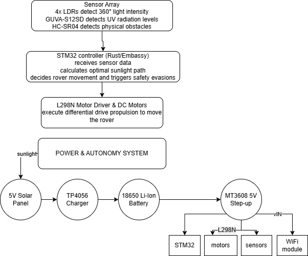
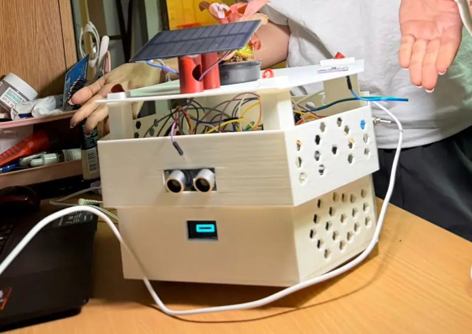
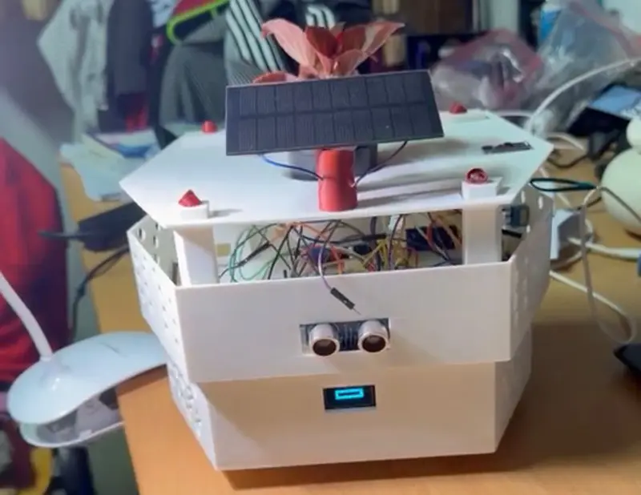
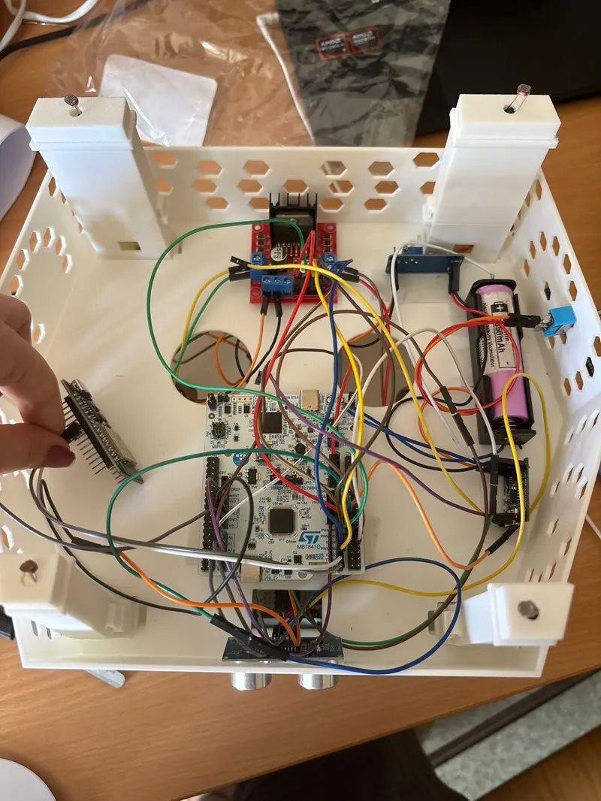
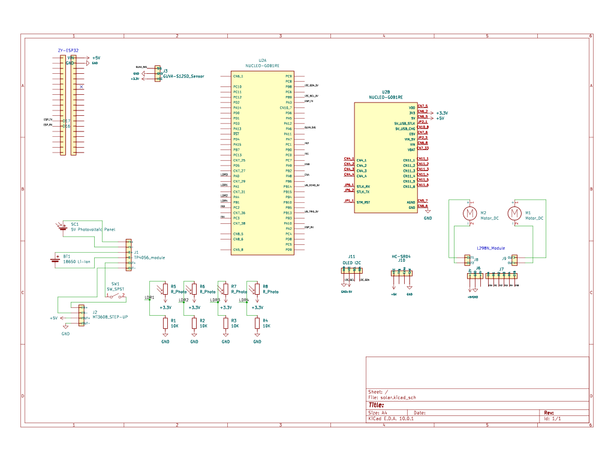

# S.O.L.A.R. Rover

An autonomous mobile platform designed to optimize the growth environment for indoor plants.

:::info 

**Author**: Bosie Teodora \
**GitHub Project Link**: https://github.com/UPB-PMRust-Students/fils-project-2026-teobosie28

:::

<!-- do not delete the \ after your name -->

## Description
 Self-driving plant pot that actively moves around a room to keep indoor plants healthy. It features a custom 3D-printed chassis that holds the plant and a solar panel on top, while hiding the electronics and motors underneath. Powered by an STM32 microcontroller and programmed in Rust, the rover uses four light sensors to find and drive toward the best patches of sunlight. To protect the plant, a UV sensor acts as an alarm that tells the rover to hide in the shade if the sun gets too intense. An ultrasonic sensor helps it dodge obstacles like furniture. The system is designed to be highly independent, using the solar panel to constantly recharge its battery for long-term use without needing to be plugged in. Finally, the ESP32 WiFi chip sends live updates to a remote dashboard, allowing you to easily check on the rover's status from afar.
## Motivation
The inspiration for the S.O.L.A.R. Rover comes from a recent personal interest in keeping indoor plants and a rather frustrating failure. Despite my best efforts and constant care, a basil plant I tried to grow simply wouldn't survive. That experience made me realize just how difficult it can be to maintain the perfect lighting for a plant to thrive indoors. At the same time, I was looking for a serious technical challenge. I had never built a robot before, and I specifically wanted to push myself to program a physical system that could actually move and navigate its surroundings. This project was born as a way to learn about locomotion and hardware, while finally solving the exact problem that doomed my basil.
## Architecture 

## Log

<!-- write your progress here every week -->

# Week 5 
I finalized my idea and came to the conclusion that I want to include a solar panel for autonomy.
# Week 7 
I ordered the components and started to figure out how I wanted the 3D chassis to look in order for it to be as professional as possbile. 
# Week 9
My components arrived and I started to look into the photoresistors functionality and sensitivity to the light intesity of the sun. I also struggled with using a soldering iron for the first time.
# Week 10
I started my rover design and decided to have some floors inside the internal structure in order to have a better organization of the jumpers. The first level will be for the battery and breadboard whereas the second one will be for the STM32 microprocessor and the  L98N module with a 5.5 cm distance between them. Also, I want to update my hardware complexity for which I have ordered a OLED I2C(SSD1306), giving more personality to my robot.
# Week 11
I started printing, and while the 3D matches my vision overall, I quickly realized I had forgotten a few technical details regarding the mounting tolerances. It took some adjustments and tweaking, but I eventually managed to put together a fully functional design. On the software side, I finally started diving into the code. I began testing the sensors by running some basic scripts at first, just to verify that they were communicating properly and actually sending data.
# Week 12
I continued with the sensor testing and bumped into a frustrating issue with the L298N motor driver. I assumed it was dead and bought a replacement. To my surprise, I discovered that the real issue was that I wasn't powering it correctly; being a budget module, the L298N requires a significantly higher current than I was providing. To make testing easier, I also wired in a physical switch to turn the motors on and off. This allowed me to safely run an analysis on the sensors and calibrate some accurate peak and low threshold values without the robot trying to drive off my desk.
# Week 14
 I mounted all the components onto the robot, but immediately ran into problems with the ultrasonic sensor, which refused to return any readings, so I swapped it out. Power distribution also became a major headache. I had to give up on powering the STM32 from the Li-ion battery because the setup was faulty and inconsistent. Ultimately, to guarantee everything works smoothly for the presentation day, I made the practical decision to just use an external power bank to reliably power both MCUs.

## Hardware
The hardware platform of the project is centered around the STM32 Nucleo-U545RE-Q development board, which acts as the main MCU of the rover. Two 3V-6V DC gear motors are used for the differential drive propulsion, paired with a ball caster for stability, and are interfaced with the MCU via an L298N Dual H-Bridge motor driver. An array of four LDR photoresistors is utilized for 360-degree directional light tracking, alongside a GUVA-S12SD UV sensor for detecting high-intensity radiation and an HC-SR04 ultrasonic sensor for obstacle avoidance. Wireless connectivity for remote telemetry is provided by an ESP32 WiFi module.Energy harvesting and power management are handled by a 5V photovoltaic panel that trickle-charges an onboard 18650 Li-Ion battery via a TP4056 charger and an MT3608 step-up regulator. The mechanical structure of the rover itself is manufactured using a custom 3D-printed modular frame, featuring a two-tier chassis that houses the electronics and powertrain on the lower deck and a conical universal pot holder on the upper deck.

### Photos

### Schematics

### Bill of Materials

| Device | Usage | Price |
|--------|--------|-------|
| [STM32 Nucleo-U545RE-Q](https://www.st.com/en/evaluation-tools/nucleo-u545re-q.html) | Main microcontroller| ~borrowed |
| [Breadboard (830 points)](https://electronicmarket.ro/mb102-830-puncte-fara-lipire-breadboard?search=breadboard) | Rapid prototyping and circuit connections | ~ 9,89 RON |
| [Jumper Wires Set] | Electrical interconnections between modules | ~owned |
| [4x Resistors (10k ohms)]| Voltage dividers for the LDR photoresistor array | ~owned |
| [DC Gear Motors (3V-6V)+Wheels](https://electronicmarket.ro/6v-250-rpm-motor-si-roti?search=roti) | Differential drive propulsion| ~31,28 RON |
| [Car Caster](https://electronicmarket.ro/roti-robot-masina-roata-universala?search=roata) | Assuring stability | ~5,80 RON |
| [L298N Dual H-Bridge](https://www.handsontec.com/dataspecs/L298N%20Motor%20Driver.pdf) | Interface between MCU PWM signals and motors | ~borrowed |
| [LDR (Photoresistors)](https://electronicmarket.ro/ldr-rezistent-sensibil-la-lumina-fotorezistor-5mm?search=ldr) | Quad-array (360 °) for directional light tracking | ~1,12RON |
| [GUVA-S12SD UV Sensor](https://electronicmarket.ro/senzor-de-intensitate-uv-soare-240nm-370nm-guva-s12sd?search=guva) | Safety for high-intensity radiation | ~24,93 RON |
| [HC-SR04 Ultrasonic Sensor](https://ardushop.ro/en/electronics/2289-ultrasonic-sensor-module-hc-sr04-6427854030726.html) | Obstacle avoidance during navigation | ~5,65 RON |
| [5V Photovoltaic Panel](https://sigmanortec.ro/Panou-solar-5V-1W-p130575921) | Energy harvesting for battery trickle-charging | ~25,45 RON |
| [TP4056 Li-Ion Charger](https://electronicmarket.ro/tp4056-tip-c-protejat-modul-de-incarcare-baterie-litiu-litiu?search=tp%204056) | Li-Ion battery charging module | ~4,60 RON |
| [MT3608 Step-up Module](https://electronicmarket.ro/modul-mt3608-2a-dc-dc-step-up-convertor-tensiune-arduino?search=MT3608) | 5V voltage regulation/boost | ~5,01 RON |
| [18650 Li-Ion Battery] | Onboard power storage | ~borrowed |
| [18650 Battery Holder](https://ardushop.ro/en/electronics/31-1x-18650-battery-holder-6427854027979.html) | Physical casing/contacts for the battery | ~2,18 RON |
| [ESP32 ESP-WROOM-32](https://www.espressif.com/en/products/socs/esp32) | WiFi telemetry for remote monitoring | ~borrowed |
| [3D Printed Frame] | Custom-designed modular mechanical structure | ~3D printer owned |
| [OLED Display 0.96" I2C IIC](https://sigmanortec.ro/Display-OLED-0-96-I2C-IIC-Albastru-p135055705) | Used for showing the rover spefic mode through a facial expression | ~18.97 |

## Software

| Library | Description | Usage |

| embassy-stm32 | Hardware abstraction layer for STM32 microcontrollers | Provides the HAL for ADC (sensors), PWM (motors), I2C (OLED), UART (telemetry), EXTI (ultrasonic), and DMA/interrupt bindings |

| embassy-executor | Async task executor for embedded systems | The async runtime allowing simultaneous navigation, motor control, display updates, and sensor polling |

| embassy-time | Time management utilities | High-precision timing for ultrasonic echo measurement, periodic sensor loops, and motor self-test delays |

| embassy-sync | Async synchronization primitives | Shared rover state (Mutex) and motor command passing (Channel) between tasks |

| cortex-m | Cortex-M low-level support | Core/peripheral access and critical-section support for bare-metal firmware |

| cortex-m-rt | Cortex-M runtime | Startup and interrupt runtime for the STM32 firmware |

| defmt | Lightweight embedded logging framework | Structured real-time debugging logs (navigation state, motor commands, telemetry) |

| defmt-rtt | RTT transport for defmt logs | Transmits debugging logs over the ST-Link debug probe |

| panic-probe | Panic handler for embedded debugging | Safety crate for immediate error reporting and system halt |

| heapless | Heapless data structures | Fixed-capacity String for UART JSON telemetry payloads (no heap allocation) |

| embedded-hal | Hardware abstraction layer traits | Standard PWM traits used by the motor driver layer |

| embedded-graphics | Embedded drawing library | Draws status icons/shapes on the OLED display |

| ssd1306 | SSD1306 OLED display driver | Controls the 128×64 OLED over I2C |

| esp-idf-hal | ESP-IDF hardware abstraction layer | ESP32 peripheral access and integration with the ESP-IDF runtime |

| esp-idf-svc | ESP-IDF services layer | Higher-level ESP-IDF services (e.g. Wi-Fi/networking and event handling) |

| anyhow | Flexible error handling | Propagates setup/runtime errors on the ESP32 side |

| log | Logging facade | Logging interface for the ESP32 firmware (backed by ESP-IDF logger) |

| embuild | ESP-IDF build integration (build dependency) | Build-time glue for compiling/linking against ESP-IDF |

## Links

<!-- Add a few links that inspired you and that you think you will use for your project -->

1. [robot inspiration](https://www.youtube.com/watch?v=wB7i1HEBsNc)
2. [GPIOs and Interrupts](https://www.youtube.com/watch?v=F6tI-qjXv_s)
3. [Embassy Bible](https://embassy.dev/book/#_what_is_embassy)

