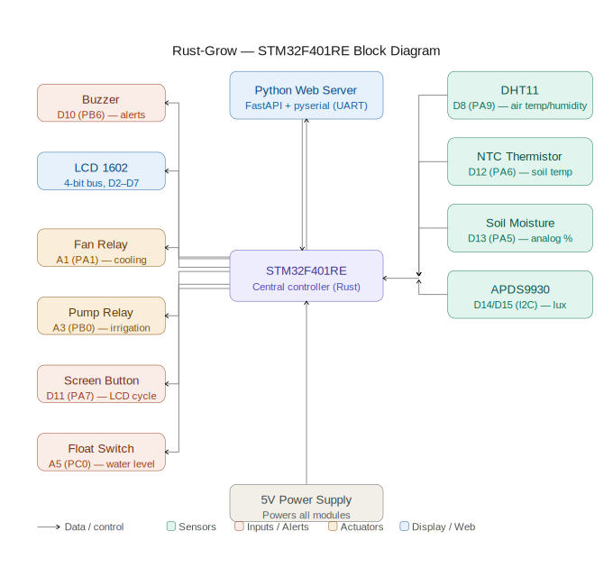
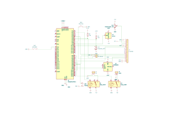
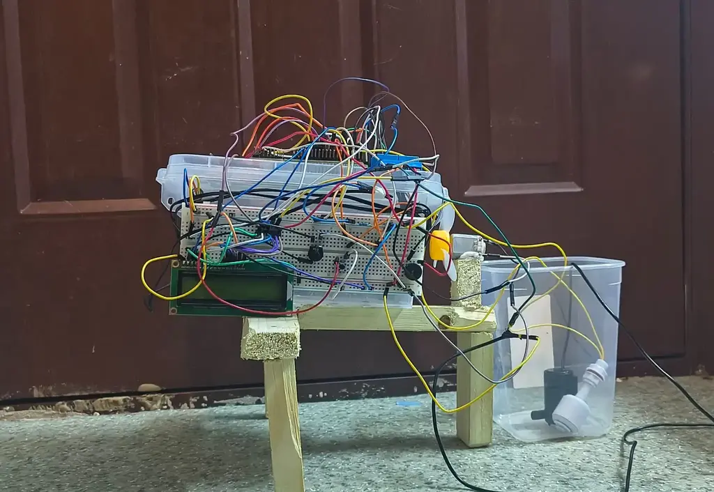
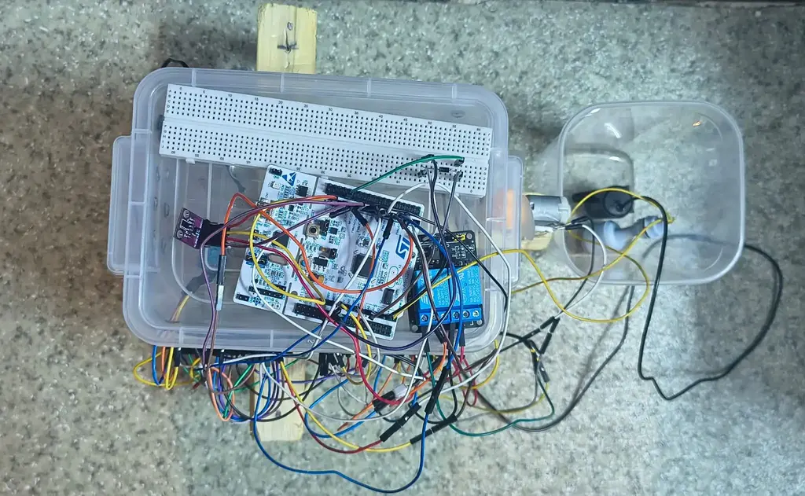

# 🌱 # Rust-Grow

An automated greenhouse project featuring Rust firmware + a Python web interface.

:::info

**Author:** Yehor Zaplishnyi \
**GitHub Project:** [rust-grow](https://github.com/UPB-PMRust-Students/fils-project-2026-yehor.zaplishnyi)

:::

---
## Description

This project focuses on building an automated greenhouse system using an STM32F401RE microcontroller as the central controller. The goal is to design a practical environmental monitoring and control solution that maintains optimal growing conditions through real-time sensor data collection, processing, and automated actuator control.

The system monitors key environmental parameters including air temperature, humidity, soil moisture, soil temperature, and light intensity. All sensor data is processed in Rust on the STM32's ARM Cortex-M core, providing low-power, memory-safe, and reliable operation. An LCD 1602 display shows live readings cycling through all parameters. A fan relay maintains air circulation on an automated duty cycle, while a pump relay handles irrigation automatically based on soil moisture levels. A Python web interface allows remote monitoring and manual control over UART.

## Motivation

I want to start growing plants at home, but I know that I cannot always be around to monitor them. Watering at the wrong time, forgetting to check the temperature on a cold night, or not noticing that the soil has become too dry — all of these things can easily kill a plant. I wanted to build a system that watches over the greenhouse for me, reacts automatically to changes in the environment, and alerts me when something needs attention. This project gave me the opportunity to combine my interest in embedded systems with something practical and useful in everyday life.

## Architecture Overview

This project is split into separate technical layers to ensure a clean separation of concerns:

1. **The Firmware Layer (`src/`):** Bare-metal Rust code compiled for the STM32F401RE microcontroller. It handles direct sensor readings and physical relay/hardware control.
2. **The Web Layer (`web/`):** A host-side Python FastAPI server providing a user-friendly browser interface.
3. **The Communication Layer (UART API):** The bridge contract linking the two environments together. Because the backend environment is completely separated from the embedded environment, this dedicated hardware-agnostic text protocol is used to relay cross-system commands.

---

## Hardware Configuration
---
| Component | Pin | Description |
|-----------|-----|-------------|
| DHT11 (air temperature/humidity) | D8 (PA9) | Environment monitoring |
| NTC thermistor (soil temperature) | D12 (PA6) | Root environment tracking |
| Soil sensor (soil moisture) | D13 (PA5) | Custom analog mapping |
| APDS9930 SCL (light intensity) | D15 (PB8) | I2C Clock |
| APDS9930 SDA | D14 (PB9) | I2C Data |
| LCD 1602 RS | D2 (PA10) | Display Control |
| LCD 1602 EN | D3 (PB3) | Display Enable |
| LCD D4/D5/D6/D7 | D4/D5/D6/D7 | 4-bit Data Bus |
| Fan Relay IN1 | A1 (PA1) | Actuator for air-cooling |
| Pump Relay IN2 | A3 (PB0) | Actuator for hydration |
| Buzzer | D10 (PB6) | Audio feedback & safety alarms |
| Float switch (water level) | A5 (PC0) | Main reservoir dry-run protection |
| Screen button | D11 (PA7) | Manual LCD view toggling |
| Reset button | B1 (PC13) | System hardware reset |

**Resistors:** 10kΩ between 3.3V and PA6 (NTC), 10kΩ between 3.3V and PA5 (Soil)
---
### Diagram
---

---
### Schematics
---

---
### Bill of Materials
---
| Device | Usage | Price |
| ------ | ----- | ----- |
| [STM32 Nucleo-64](https://www.st.com/en/evaluation-tools/nucleo-f401re.html) | Core microcontroller | 120 |
| 5V Power Supply | System power | 0 |
| DHT11 | Air temperature & humidity sensor | 4.64 lei |
| NTC Thermistor | Soil temperature (ADC) | 6.49 lei|
| Capacitive Soil Moisture Sensor | Soil moisture (analog output) | 20 lei |
| [APDS9930](https://docs.broadcom.com/doc/AV02-3191EN) | Light intensity sensor (I2C) | 15 lei |
| [LCD 1602](https://www.sparkfun.com/datasheets/LCD/ADM1602K-NSW-FBS-3.3v.pdf) | 4-bit display for sensor readouts | 9.82 lei |
| Fan | Air-cooling actuator | 0 |
| Water pump | Irrigation actuator | 10 lei |
| Relay module  | automation | 7.84 lei |
| Buzzer | Audio feedback & safety alarms | 0 |
| Float switch | Reservoir dry-run protection | 20 |
| Breadboard and jumper wires | Prototyping connections | 0 |
| Resistors (10kΩ x2) | Pull-up for NTC and soil sensor | 0 |
| Cable 30 cm USB AM-B Mini | debugging | 4.37 lei |
| Total | | 218.16|


---

## System Features & Automation
---
**Automation Logic:**
- **Fan Control:** Runs on an automated duty cycle: 5 minutes ON followed by 10 minutes OFF.
- **Irrigation:** Triggers dynamically when soil moisture drops below 30%. Runs the water pump for exactly 5 seconds.
- **Hardware Failure Protection:** If 2 consecutive watering cycles occur without any detected change in soil moisture, the system halts operation, sounds the buzzer continuously, and prints a failure warning to the LCD screen to prevent flooding.

**LCD Screens** (Cycle through views sequentially by pressing button D11):
- **Screen 0:** Air Temperature + Air Humidity
- **Screen 1:** Soil Moisture + Soil Temperature
- **Screen 2:** Reservoir Water Level Status
- **Screen 3:** Light Intensity (Lux)

**Web Control Functions:**
- **Fan Mode:** Remotely toggle between hard ON, hard OFF, or back to AUTO cycle.
- **Pump Burst:** Request a one-time manual 5-second watering burst.
- **Buzzer:** Force an audible beep or clear active system errors.

---

## UART API Commands
---
The Python application and the STM32 board pass text-based instructions over a Serial (UART) data connection at **9600 Baud**.

| Command Code | System Action |
|--------------|---------------|
| `F1` | Fan ON |
| `F0` | Fan OFF |
| `FA` | Fan AUTO (Resumes timed cycle) |
| `P1` | Run pump manual 5 sec sequence |
| `P0` | Force Pump OFF |
| `B1` | Turn Buzzer ON |
| `B0` | Turn Buzzer OFF / Acknowledge and Reset Errors |

---

## Setup & Installation
---
### STM32 Firmware

```bash
# Install the embedded ARM target architecture support
rustup target add thumbv7em-none-eabihf

# Install flashing and debugging utilities
cargo install probe-rs-tools --locked

# Direct compilation and hardware execution
cargo run

# Alternative: Manual compilation and Mass Storage (D:) drag-and-drop flash
cargo build
copy target\thumbv7em-none-eabihf\debug\rust-grow D:\
```
---
### Python Web Server
---
```bash
# Install server framework dependencies and communication drivers
pip install fastapi uvicorn pyserial

# Navigate to application runtime directory
cd web

# Initialize local platform hosting
py server.py
```

---

## Project Structure
---
```
src/
├── main.rs       Application initialization and real-time execution loop
├── dht11.rs      Bit-banging driver for ambient temperature/humidity
├── ntc.rs        ADC calculation algorithms for thermistor values
├── soil.rs       Moisture scale percentage conversion driver
├── apds9930.rs   I2C protocol interpreter for ambient lux tracking
├── lcd1602.rs    4-bit architecture driver for peripheral UI text displays
├── relay.rs      GPIO state controllers managing external fan relays
├── pump.rs       GPIO state controllers managing external pump relays
├── buzzer.rs     Sound output toggle frequencies
├── float.rs      High/Low state register readers tracking physical float switches
└── bin/
    └── test.rs   Debug configuration test environment for isolated sensors

web/
├── server.py     Python FastAPI routing application managing web calls to UART translation
└── index.html    Client browser management dashboard visual interface
```

---

## Software
---
| Library | Description | Usage |
| ------- | ----------- | ----- |
| [cortex-m](https://crates.io/crates/cortex-m) | ARM Cortex-M processor support | Core embedded Rust runtime |
| [cortex-m-rt](https://crates.io/crates/cortex-m-rt) | Runtime for Cortex-M | Startup and interrupt handling |
| [stm32f4xx-hal](https://crates.io/crates/stm32f4xx-hal) | HAL for STM32F4 series | Hardware abstraction layer |
| [panic-halt](https://crates.io/crates/panic-halt) | Panic handler | Halts on panic |
| [embedded-hal](https://crates.io/crates/embedded-hal) | Hardware abstraction traits | Sensor/driver compatibility |
| [dht-sensor](https://crates.io/crates/dht-sensor) | DHT11 temperature & humidity driver | Air sensor readings |
| [apds9930](https://crates.io/crates/apds9930) | APDS9930 light sensor driver | Ambient lux via I2C |
| [heapless](https://crates.io/crates/heapless) | Static data structures | No-heap collections |
| [nb](https://crates.io/crates/nb) | Non-blocking abstractions | Async-style I/O |
| [defmt](https://crates.io/crates/defmt) | Efficient embedded logging | Debug output |
| [defmt-rtt](https://crates.io/crates/defmt-rtt) | RTT transport for defmt | Logging over debug probe |

---

## Log
---
### Week 7 - Project idea defined

Came up with the concept of Rust-Grow — an automated greenhouse system. Decided on the STM32F401RE as the main controller and Rust as the programming language. Outlined the list of sensors and actuators needed.

### Week 8 - Documentation complete

Wrote the full project documentation including architecture description, hardware pin table, UART API, and software library list. Defined the automation logic for fan duty cycle, soil moisture irrigation, and hardware failure protection.

### Week 9 - Hardware ordered

Ordered all hardware components. Currently waiting for delivery.

### Week 12 - Hardware Arrived

All ordered components were delivered. Started wiring and assembling the hardware setup.

### Week 14 - Project Completed

Finished development — firmware, web server, and hardware all tested and working together.




---

## Links
---
### Hardware References
- [STM32F401RE Datasheet](https://www.st.com/resource/en/datasheet/stm32f401re.pdf)
- [STM32 Nucleo-64 User Manual](https://www.st.com/resource/en/user_manual/um1724-stm32-nucleo64-boards-mb1136-stmicroelectronics.pdf)
- [DHT11 Datasheet](https://www.mouser.com/datasheet/2/758/DHT11-Technical-Data-Sheet-Translated-Version-1143054.pdf)
- [APDS9930 Datasheet](https://docs.broadcom.com/doc/AV02-3191EN)
- [LCD 1602 Datasheet](https://www.sparkfun.com/datasheets/LCD/ADM1602K-NSW-FBS-3.3v.pdf)

### Rust Embedded Libraries
- [cortex-m](https://crates.io/crates/cortex-m)
- [cortex-m-rt](https://crates.io/crates/cortex-m-rt)
- [stm32f4xx-hal](https://crates.io/crates/stm32f4xx-hal)
- [embedded-hal](https://crates.io/crates/embedded-hal)
- [panic-halt](https://crates.io/crates/panic-halt)
- [dht-sensor](https://crates.io/crates/dht-sensor)
- [apds9930](https://crates.io/crates/apds9930)
- [heapless](https://crates.io/crates/heapless)
- [nb](https://crates.io/crates/nb)
- [defmt](https://crates.io/crates/defmt)
- [defmt-rtt](https://crates.io/crates/defmt-rtt)

### Python Web Stack
- [FastAPI Documentation](https://fastapi.tiangolo.com/)
- [Uvicorn](https://www.uvicorn.org/)
- [pyserial](https://pyserial.readthedocs.io/en/latest/)

### Inspiration & Related Projects
- [The Embedded Rust Book](https://docs.rust-embedded.org/book/)
- [probe-rs](https://probe.rs/)
- [Awesome Embedded Rust](https://github.com/rust-embedded/awesome-embedded-rust)
---
