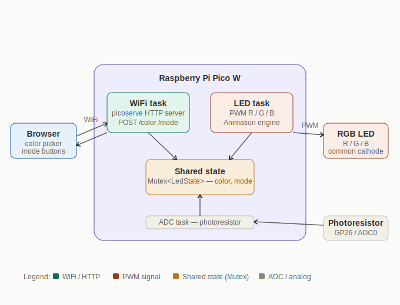
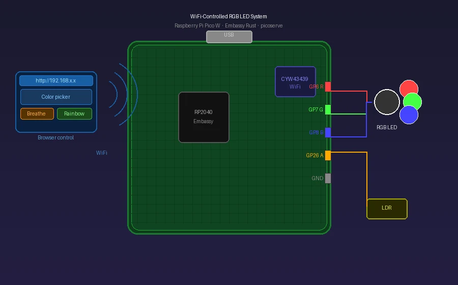

# WiFi-Controlled RGB LED System

A browser-controlled RGB LED system using Raspberry Pi Pico W, Embassy Rust, and a local WiFi web interface.

:::info

**Author:** Yosri BELHEDI  \
**GitHub Project Link:** https://github.com/UPB-PMRust-Students/yosri.belhedi

:::

## Description

This project is a WiFi-controlled RGB LED system built with a Raspberry Pi Pico W. The Pico W connects to a local WiFi network and hosts a small web page that can be opened from a phone or laptop browser.

From the web interface, the user can change the RGB LED color, brightness, and lighting mode. The project does not need a cloud service or a dedicated mobile application.

## Motivation

I chose this project because it combines several important embedded systems concepts in a small and realistic application. It uses PWM for controlling the RGB LED, WiFi communication for browser control, asynchronous Rust programming with Embassy, and optional ADC reading for automatic brightness adjustment.

The project is also visual and easy to test, because every software change can be immediately seen on the RGB LED.

## Architecture

The project is divided into the following main software components:

- **WiFi module**: connects the Raspberry Pi Pico W to the local WiFi network.
- **HTTP server module**: serves the control web page and receives commands from the browser.
- **State module**: stores the current LED color, brightness, and active mode.
- **LED control module**: reads the current state and updates the PWM outputs for the red, green, and blue LED channels.
- **ADC module**: optionally reads the photoresistor value for the auto-dim mode.

The browser communicates with the Pico W through HTTP requests. The HTTP server updates the shared LED state, and the LED control module uses this state to update the RGB LED.

## Log

### Week 5 - 11 May

- Choose the project idea and main board.
- Decide to use Raspberry Pi Pico W because it has built-in WiFi.
- Define the main features: RGB control, brightness control, and lighting modes.
- Prepare the initial hardware and software architecture.

### Week 12 - 18 May

- Set up the Rust embedded development environment.
- Test basic GPIO and PWM control on the Raspberry Pi Pico W.
- Connect and test the RGB LED with current-limiting resistors.
- Start implementing the LED control module.

### Week 19 - 25 May

- Implement WiFi connection.
- Add the local HTTP server and browser control page.
- Connect the HTTP commands to the LED state.
- Test the lighting modes and optional auto-dim feature.

## Hardware

The hardware is based on a Raspberry Pi Pico W, which is used as the main microcontroller and WiFi interface. A common-cathode RGB LED is connected to three PWM-capable GPIO pins through current-limiting resistors.

An optional photoresistor can be connected to an ADC pin to measure ambient light and adjust brightness automatically. An optional push button can be used to change lighting modes without using the web interface.

## Schematics

## Bill of Materials

| Device | Usage | Price |
|---|---|---|
| Raspberry Pi Pico W | Main microcontroller with WiFi | 35 RON |
| Common-cathode RGB LED | Visual output | 3 RON |
| 100 Ω resistors x3 | Current limiting for RGB channels | 1 RON |
| Photoresistor | Ambient light sensing | 3 RON |
| 10 kΩ resistor | Voltage divider for photoresistor | 1 RON |
| Tactile push button | Optional physical mode switch | 2 RON |
| Breadboard | Prototyping circuit | 10 RON |
| Jumper wires | Electrical connections | 10 RON |

## Software

| Library | Description | Usage |
|---|---|---|
| `embassy-rp` | Hardware abstraction layer for RP2040 | Used for GPIO, PWM, and ADC on the Raspberry Pi Pico W |
| `embassy-executor` | Async task executor | Used to run the WiFi task, HTTP server task, and LED control task |
| `embassy-sync` | Synchronization primitives | Used for sharing the LED state between async tasks |
| `embassy-net` | Async networking stack | Used for TCP/IP communication over WiFi |
| `cyw43` | WiFi driver for the Pico W chip | Used to control the CYW43439 WiFi chip |
| `picoserve` | Lightweight embedded HTTP server | Used to serve the web interface and receive browser commands |
| `embassy-time` | Time and delay utilities | Used for animations, timing, and periodic updates |
